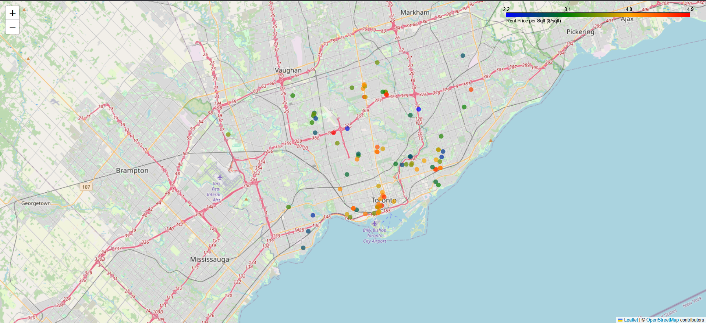
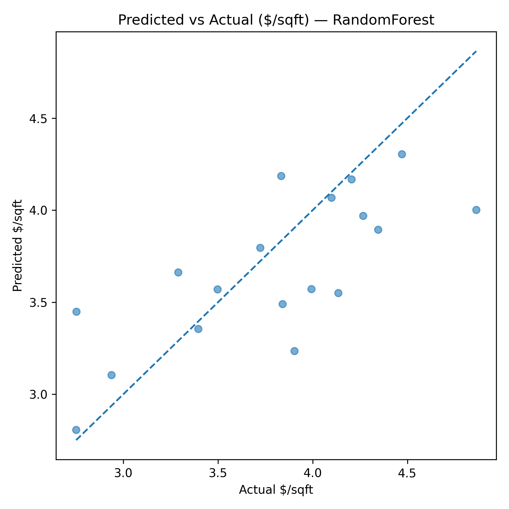
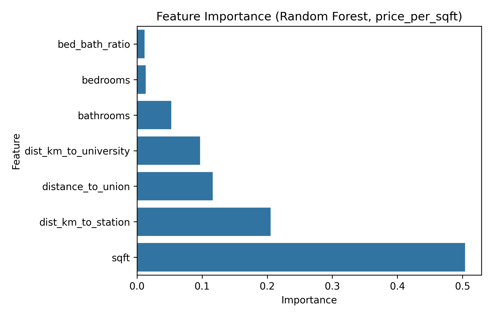
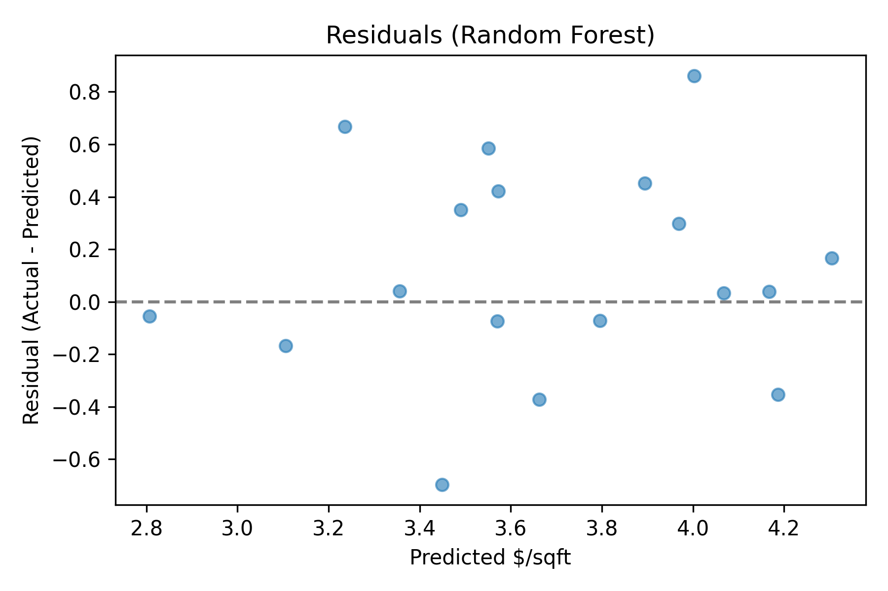

# Toronto Rentals Price Analysis & Prediction

This project explores what drives Toronto rental prices and builds machine learning models to predict rent per square foot ($/sqft). It combines data collection, cleaning, feature engineering, geospatial analysis, and ML modeling into an end-to-end pipeline.


## Project Structure
```
toronto-rentals/
│── data/
│   ├── raw/          # raw CSVs (listings, subway stations, universities)
│   ├── interim/      # cleaned listings
│   └── processed/    # final dataset with features
│── notebooks/
│   ├── 01_collect_and_clean.ipynb
│   ├── 02_geocoding.ipynb
│   ├── 03_features_distances.ipynb
│   ├── 04_eda.ipynb
│   └── 05_modeling.ipynb
│── src/              # utility functions (cleaning, geocoding, feature engineering)
│── visuals/          # screenshots, folium maps
│── README.md
```
## How to Run
1. **Clone the repository**
   ```bash
   git clone https://github.com/<your-username>/toronto-rentals-ml.git
   cd toronto-rentals-ml
2. **Create a virtual environment**
    ```bash
    python -m venv .venv
    # On Windows (PowerShell)
    .\.venv\Scripts\Activate.ps1
    # On macOS/Linux
    source .venv/bin/activate
3. **Install dependencies** 
    ```bash
    pip install -r requirements.txt
4. **Set up your API keys**
- Create a .env file in the project root and add:
```ini
GOOGLE_MAPS_API_KEY=your_api_key_here
```
5. **Run notebooks**
Open the Jupyter notebooks in the notebooks/ folder in order:
- 01_collect_and_clean.ipynb → Clean raw rental data
- 02_geocoding.ipynb → Add geospatial info (Google Maps API)
- 03_features_distances.ipynb → Compute distances & features
- 04_eda.ipynb → Exploratory analysis
- 05_modeling.ipynb → Train & evaluate ML models
6. **View outputs**
- Processed datasets → data/processed/
- Visuals (plots, maps) → visuals/
- Model metrics → visuals/model_metrics.csv
## Data Pipeline

1. ### Data Collection

 - ~100 rental listings manually collected.

 - Subway station + university data added from external sources.

2. ### Cleaning

 - Removed duplicates, fixed inconsistent formatting.

 - Outliers removed: rent < $1200, price_per_sqft < 2 or > 5.

3. ### Feature Engineering

 - price_per_sqft

 - bed_bath_ratio

 - Distance to nearest subway station

 - Distance to Union Station (downtown core)

 - Distance to nearest university

4. ### Exploratory Data Analysis (EDA)

 - Histograms, scatterplots, correlation heatmaps.

 - Grouped analysis by bedrooms & stations.

 - Geospatial visualizations with Folium maps.

## Key Insights

- Larger apartments → higher absolute rent, but lower $/sqft (discount effect).

- Location matters: closer to subway or Union Station → higher $/sqft.

- University proximity has weaker effect (local to student-heavy areas).

- Bedrooms/bathrooms add little once size is controlled for.
## Geospatial Visualization
Rental listings across Toronto, colored by rent price per sqft.
Apartments closer to downtown and TTC subway stations generally have higher $/sqft values.


## Modeling
The goal was to predict **rent per square foot ($/sqft)** from apartment features (size, bed/bath ratio, location, distances).

### Approach
- Target variable: `price_per_sqft`
- Train/test split: 80/20
- Evaluation metrics: Mean Absolute Error (MAE), Mean Absolute Percentage Error (MAPE), and R².

### Models Tested
1. **Linear Regression**
   - Baseline model.
   - Captured general trend but struggled with nonlinear effects.

2. **Log-Linear Regression**
   - Applied log transform to target.
   - Reduced skew and slightly improved error over plain linear regression.

3. **Random Forest Regressor**
   - Handled nonlinearities and feature interactions well.
   - Achieved lowest MAE and best R² among all models.

4. **Gradient Boosting**
   - Strong performance but slightly worse than Random Forest on this dataset (likely due to small sample size).

### Results

  | model            | MAE   | RMSE  | R²    |
| ---------------- | ----- | ----- | ----- |
| Random Forest    | 0.317 | 0.404 | 0.507 |
| GradientBoosting | 0.322 | 0.429 | 0.443 |
| Linear           | 0.349 | 0.439 | 0.419 |
| Log-Linear       | 0.373 | 0.473 | 0.327 |

- **Best Model**: Random Forest (MAE ≈ 0.317, R² ≈ 0.51).
## Visualizations
### Predicted vs Actual ($/sqft)

### Feature Importance (Random Forest)

### Residuals Plot


### Key Result: Random Forest achieved MAE ≈ 0.317 and R² ≈ 0.51, showing that size and proximity to subway stations are the most important predictors of rent per sqft.
## Tech Stack
- Python, Pandas, NumPy, scikit-learn
- Geocoding with Google Maps API
- Visualization with Matplotlib, Seaborn, Folium